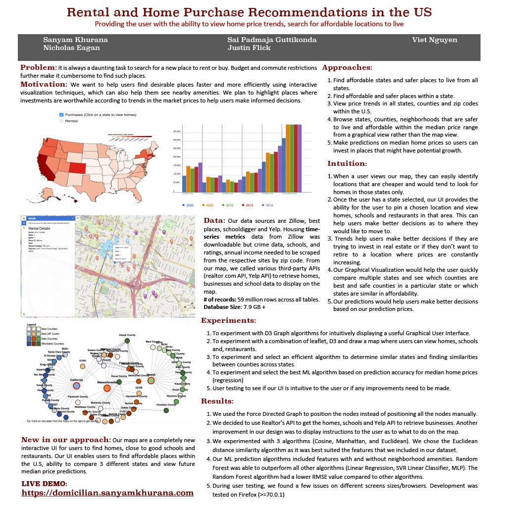

## Portfolio

---

### Rental and Home Purchase Recommendations in the US

Most current web applications can browse homes by state, zip code but they cannot intuitively
look at the U.S map and figure out a cheaper and safer place to live. The motivation behind this project is to help users who are looking to invest (buy/rent) in real estate, to be able to find affordable & safer places within the US. We are providing the following features
<ol>
<li>An intuitive way for the user to find safer, affordable places on the map.</li>
<li>Browse safer, affordable homes using a Graphical View representation.</li>
<li>Viewing trends in rising home prices.</li>
 <li>Predictions of median home prices, classifying if a place is safer, affordable or not.</li>
</ol>  
 

 

 

---

### Hospital and Medical Providers Recommendation

Medical costs have been a heavy burden for U.S families and employers for decades. There are over 3 trillion dollars in medical costs every year in the U.S. Over the last decade, the healthcare deductibles have increased over 250% and medical bills are the first reason that causes consumer bankruptcy. It is always a daunting task to search for a good quality hospital with reasonable cost.  The motivation behind this project is to help customers navigate their benefits and make better healthcare choices by providing hospital rankings for all available hospitals in the US. 

 

 

---

---

Page template forked from <a href="https://github.com/evanca/quick-portfolio">evanca</a>

<!-- Remove above link if you don't want to attibute -->
